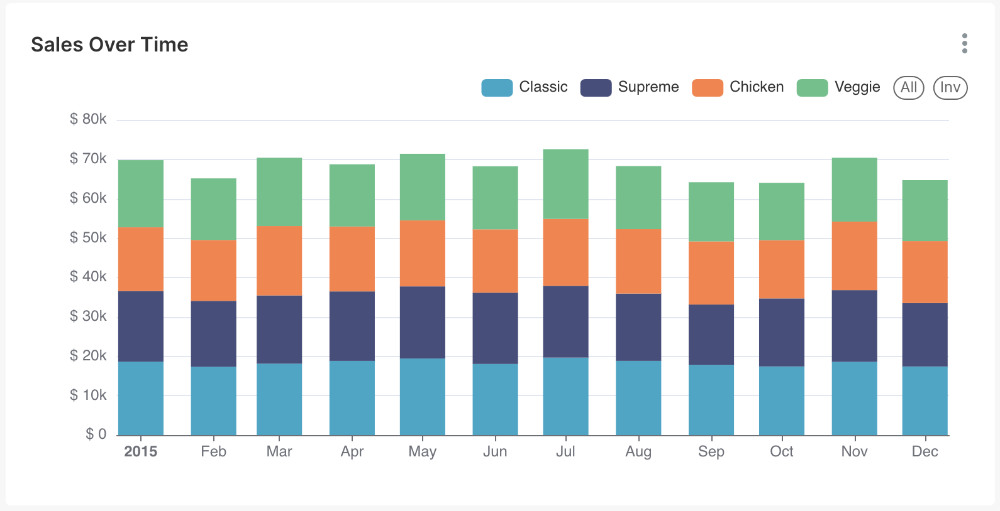
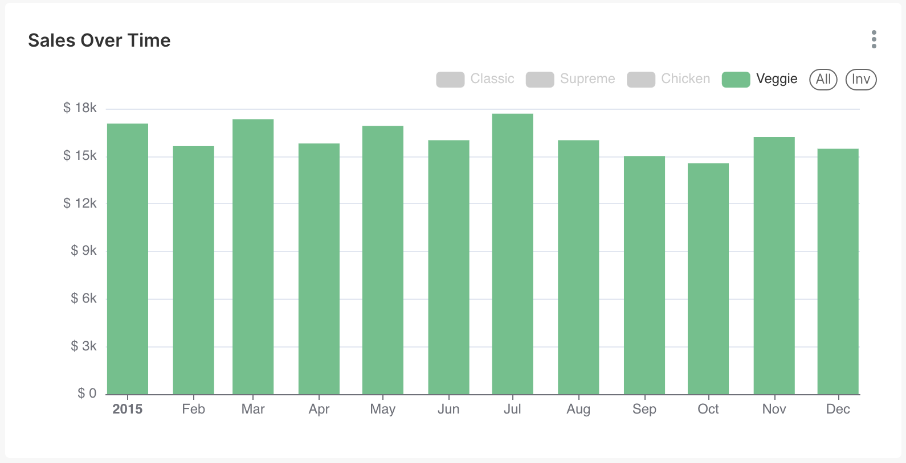
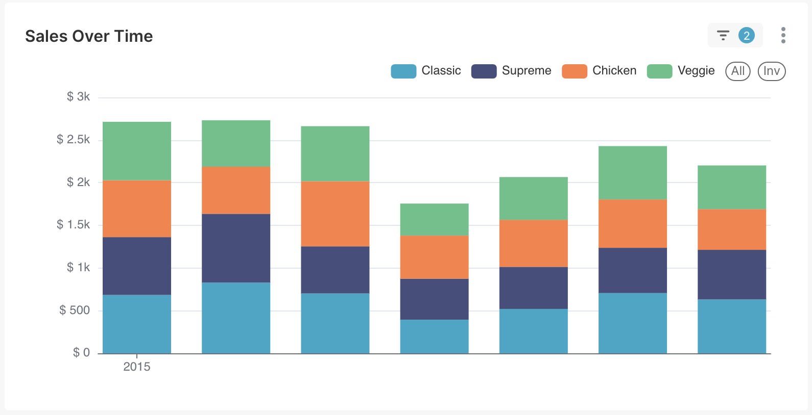
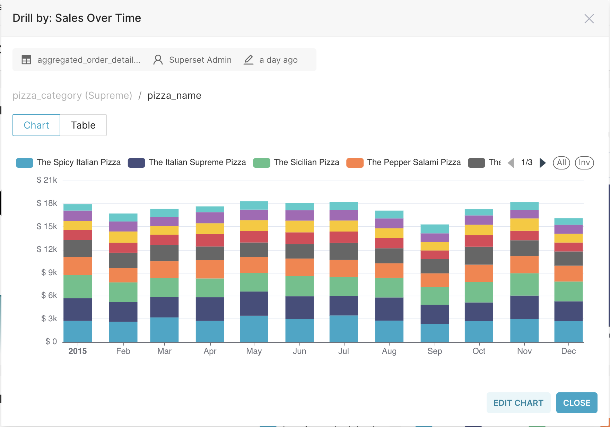
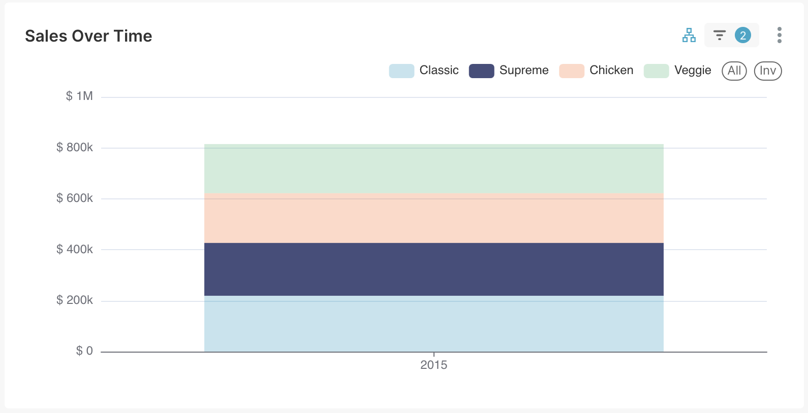
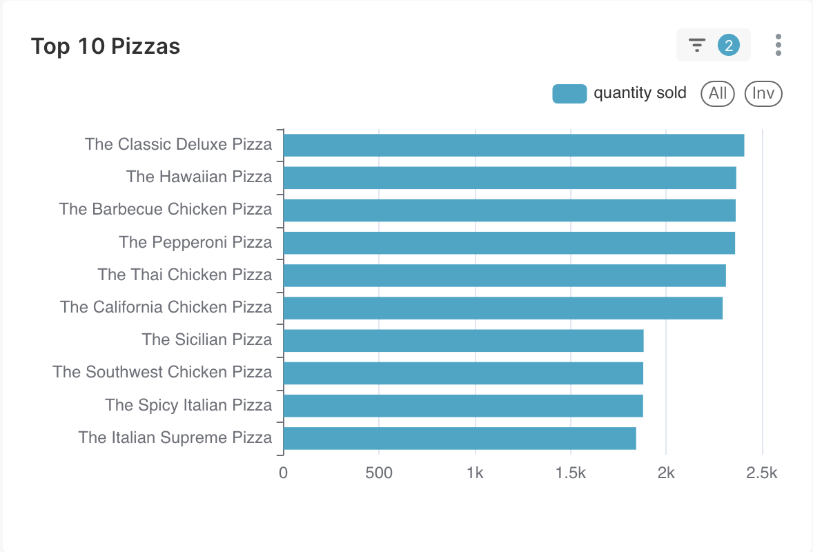
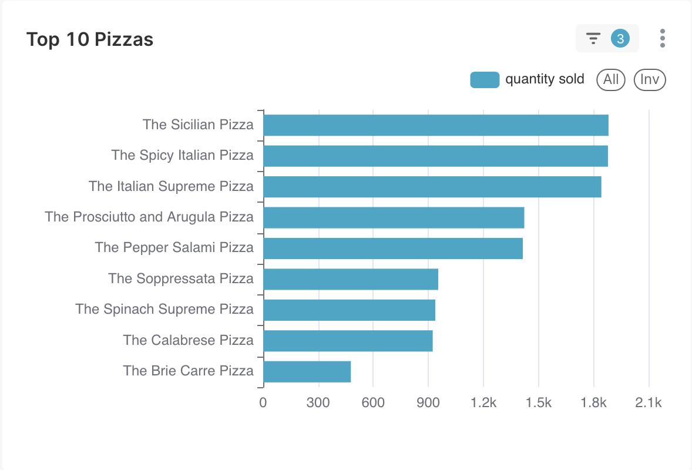
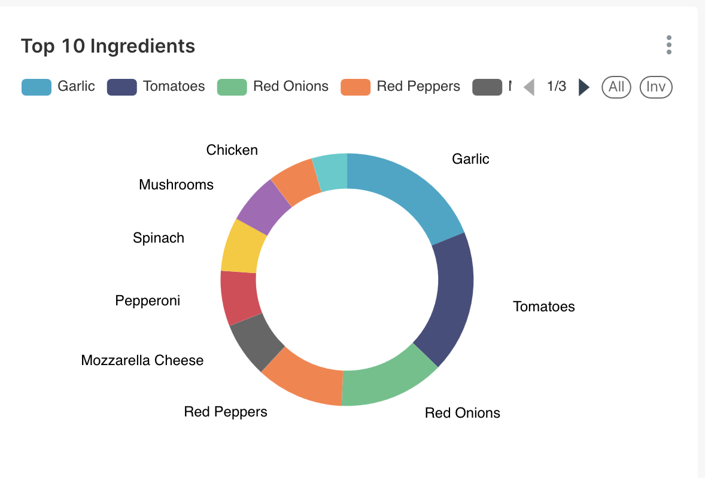
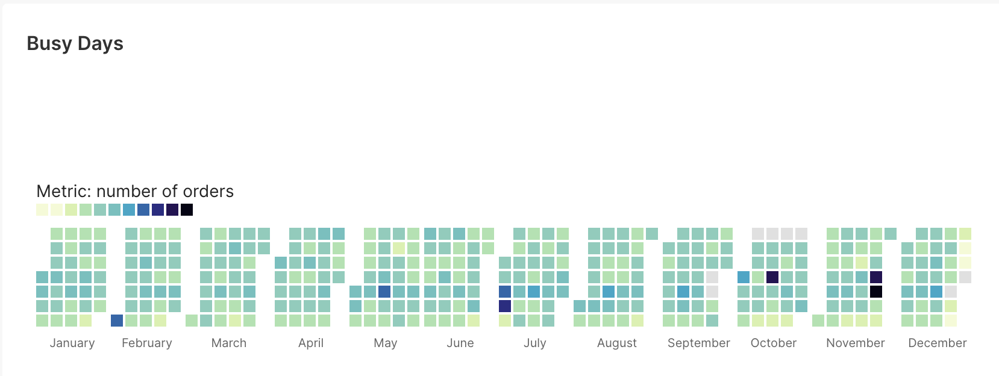
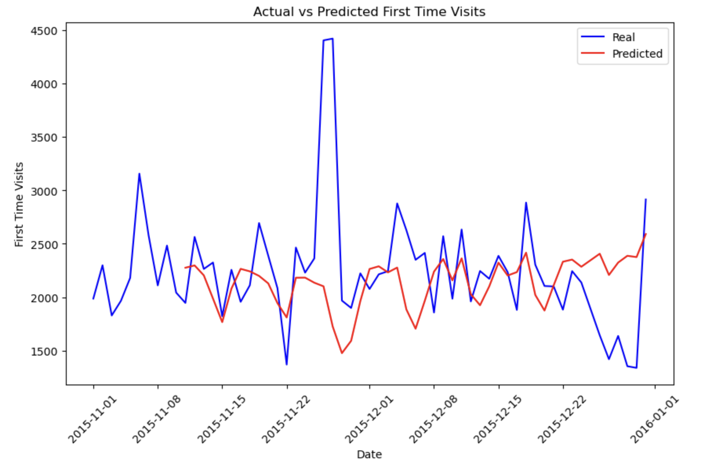

<div style="page-break-after: always; display: flex; flex-direction: column; justify-content: center; height: 100vh; text-align: center;">

<h1>Üzleti Intelligencia Labor</h1>

<h2>Dokumentáció</h2>

<h3>Szénási Krisztián</h3>
<h4>XYD66R</h4>

</div>

## Projekt elérhetősége

A projekt [ezen](https://github.com/krisztianszenasi/pizza-report) a github repón érhető el.

## A Projekt Felépítése

A projekt **docker**-t és **docker compose**-t használ a különböző komponensek leírásához illetve futtatásához. Ezek a `docker-compose.yaml` fájlban vannak leírva. Alapvetően az **Apache Airflow** által biztosított javasolt [docker-compose.yaml](https://airflow.apache.org/docs/apache-airflow/3.0.1/docker-compose.yaml) fájlból indultam ki. Ezeket egészítettem ki további **service**-ekkel.

A fontosabb **service**-ek a következőek:

* **jupyterlab**: egy **jupyter notebook**, amely tartalmaz minden fontos csomagot előre telepítve, köztük a **tensorflow**-t is
* **superset**: [Apache Superset](https://superset.apache.org/) alkalmazás, amit a vizuális megjelenítéshez használtam
* **postgres**: az [Apache Airflow](https://airflow.apache.org/) által használt **metadata** adatbázis.
* **pizza_db**: adatbázis, amely tartalmazza a `.csv` fájlokból feldolgozott adatokat

> A többi **service** az **airflow** működéséhez szükséges, és már előre biztosítva voltak.

### A projekt indítása

A projekt eléggé _plug and play_. A megfelelő docker parancsok kiadásával a projekt egyből kipróbálható

Indításhoz először is inicializálni kell az `airflow` adatbázisait:

```
docker compose up airflow-init
```

> Ez szintén a superset csapat által volt biztsoítva. Annyival egészítettem ki (`airflow/scripts/init_airflow_setup.py`) , hogy automatikusan csatlakozzon a `.csv` fájloknak szánt adatbázishoz (_pizza\_db_), valamint, hogy a **DAG**-ok egyből engedélyezve legyenek.

majd **build** segítségével elindítani a konténereket:

```
docker compose up --build
```

## Apache Airflow

Az [Apache Airflow](https://airflow.apache.org/) egy nyílt forráskódú munkafolyamat-kezelő rendszer, amelyet adatok feldolgozására és automatizált folyamatok (_ún. workflow-k_) ütemezésére és végrehajtására használnak. Python nyelven írhatóak benne az ún. **DAG**-ok (_Directed Acyclic Graph_), amelyek meghatározzák a feladatok sorrendjét és függőségeit.

A webes felület a [http://localhost:8080](http://localhost:8080) címen érhető el az `airflow:airflow` loginnal.

Az `airflow` mappa tartalmazza az össszes idekapcsolódó fájlt:

```
.
├── airflow
│   ├── config
│   ├── dags
│   ├── logs
│   ├── plugins
|   └── scripts
```


### DAG-ok

```
├── dags
│   ├── __pycache__
│   ├── aggregate_data.py
│   ├── files
│   ├── load_data_to_staging.py
│   ├── sql
│   └── transfrom_from_staging.py
```

A **DAG**-ok egyszerű **Python** szkriptek, amelyekben a kívánt folyamatok logikája megfogalmazható. Ezek a folyamatok később egy webes felületen keresztül könnyedén kezelhetők és ütemezhetők. Előnye, hogy nincs **low-code** eszközökre jellemző korlát, így tetszőlegesen összetett folyamatok is rugalmasan leírhatók, miközben a webes felületen át jól átlátható és menedzselhető marad a működésük.

Az `sql` mappa szimpla `.sql` szkripteket tartalmaz, amelyeket felhasználják a **DAG**-ok, a `file` mappa pedig a betöltendő `.csv` fájlokat.

#### load\_data\_to\_staging.py

Ez a **DAG** felelős azért, hogy a `dag/files/to_process` mappában található `.csv` fájlokat feldolgozza és betöltse a **staging** táblákba. Alapvetően négy fájlból képes dolgozni a rendszer (_orders.csv, order_details.csv, pizzas.csv és pizza_types.csv_), amelyek már egy kellően normalizált formában írják le a rekordokat. A **staging** táblák még nagyon "megenegdőek". Nincsenek rajtuk feltüntetve a **foreignkey** kapcsolatok és minden mező megengedi a `NULL` értéket. Ennek azaz oka,  hogyha bármi féle probléma van az adatokkal, attól még betölthetőek legyenek. Maga a folyamat ütemezett, így amint új fájl kerül a rendszerbe, szinte azonnal (_percenként_) feldolgozásra kerül. Amint sikeresen lefutott, a `.csv` fájlok átkerülnek a `dag/files/done` mappába.

A projekt `untouched_data` mappája tartalmazza az eredeti `.csv` fájlokat, amelyek akár egy az egyben betölthetőek a rendszerbe. Lehetőség van az adatok inkremetális betöltésére is. A `utils/spli_csv_files.py` szkript képes feldarabolni az adatokat havi lebontásba. Ezeket előre elhelyeztem a 
`utils/monthly_chunks` mappába. Innen egy segéd **shell script** segítségével könnyeden elhelyezhetünk fájlokat egy adott hónapra vontakozóan:

```
./move_orders.sh 2015_01
```

Ennek hatására a `monthly_chunks` mappából az `orders_2015_01.csv`, valamint az `order_details_2015_01.csv` fájlok átkerülnek a `dags/files/to_process` mappába a megfelelő névvel, ahonnon automatikusan feldolgozásra kerülnek.

> Fontos az átnevezés, ugyanis a rendszer csak az `orders.csv` valamint `order_details.csv` néven képes felismerni a rendeléseket.

Ezt követően automatikusan indul a következő **DAG**.

#### transfrom\_from\_staging.py

Ez a **DAG** felelős azért, hogy a **staging** táblákban lévő adatok átkerüljenek a végleges táblákba. Itt kerül ellenőrzésre, hogy az adatok helyesek-e, léteznek a hivatkozott kapcsolatok (_pl. order\_details -> order_) stb.

Ezenfelül a `pizza_types.csv`-ben található `ingredients` mező feldarabolásra kerül, ugyanis alapvetően csak egy vesszővel elválasztott **sztringként** volt tárolva, amiből nagyon nehéz lenne a népszerű alapanyagok kinyerése. Szimplán bevezettem egy új táblát (_ingredients_), amelyben elhelyeztem külön-külön az alapanyagokat, majd egy kapcsoló táblával (_pizza\_ingredients_) összekötögettem, hogy mely pizza mely alapanyagokból áll. Így szimpla **join**-ok segítségével már egészen bonyolult kimutatások végezhetőek az alapanyagokról.

Ezt követően automatikusan indul a következő **DAG**.


#### aggregate_data.py

Ez a **DAG** felelős azért, hogy a már végleles táblákból **előre aggregált** táblák készüljenek el, amelyek később felhasználásra kerülnek a megjelenítésnél. Ennek köszönhetően a kimutatások jelenetősen gyorsabbak.

Két féle aggregálás történik itt:

* A rendelések összege szummázva az adott pizza típusokkal valamint nevekkel
* Az alapanyagok megjelenése napi lebontásban.


## Apache Superset

Az [Apache Superset](https://superset.apache.org/) egy nyílt forráskódú **adatvizualizációs** és **dashboard-készítő** eszköz. Lehetővé teszi, hogy különböző adatforrásokhoz (_pl. SQL adatbázisokhoz_) kapcsolódva interaktív grafikonokat, táblázatokat és kimutatásokat hozzunk létre, mindezt kódolás nélkül.

A webes felület a [http://localhost:8088](http://localhost:8088) címen érhető el az `admin:admin` loginnal.

Maga az elkészült dashboard a **Pizza Dashboard** névre hallgat, amely a következő ábrákat tartalmazza:

### Total Sales

Egy egyszerű **"big number"** típusú vizualizáció, amely megjeleníti az összesített eladást, az előző időszakra (_napra, hétre, hónapra, stb._).


### Sales Over Time

Egy **oszlop diagram**, amely az összes eddigi eladásból képes megjeleníteni a bevételt adott időszakra, valamint előre beálított finomsággal (_nap, hónap, év, stb_).

#### Egész évre vonatkozó eladások havi lebontásban



#### Egész évre vonatkozó vega elaádsok havi lebontásban 



#### Január első hetére vonatkozó eladások napi lebotásban



#### Drill Down

Lehetőség van "lefurni" a pizza nevek szerint. Így bármilyen időszakra és felbontásban megtekinthetjük pontosan hogyan oszlottak el az eladások.

Itt például látható egész évre havi lebotásban a supereme pizzák eloszlása:




#### Cross Filter lehetőség

Egy pizza kategóriára kattintva a további ábrákon automatikusan szűrésre kerül az adott kategória. Itt például a **supreme** pizzára szűrünk.



### Top 10 Pizzas

Szintén egy **oszlop diagram**, amely az adott időszakra, vonatkozó legnéprszerűbb pizzákat tartalmazza.



Ez a chart képes reagálni az előző **cross filter**-re. Itt látható a 10 legnészerűbb **supreme** pizza az adott időszakra.



### Top 10 Ingredients

Egy **kör diagram**, amely az adott időszakra vonatkozó 10 legnépszerűbb alapanyagot mutatja.



### Busy Days

Egy **calendar heatmap**, amelyen megtekinthető, hogy az adott napokon mekkora volt a forgalom.




## Előrejelzés

Készítettem egy fájlt (_sales\_per\_day.csv_), ami tartalmazza a napi bevételeket. Ezeket egy jupyter notebookban dolgoztam fel, ami elérhető [ezen](http://localhost:8888/lab/workspaces/auto-S/tree/work/pizza_sales_prediction.ipynb) a linken. Ez csak szimpla lokálisan futtatott konténer.

Alapvetően egy évnyi, azaz 365 napnyi rekordom van. Egy körülbelül **70:15:15** eloszlásban készítettem el a **training**, **validation** valamint **test** adat halmazaimat. A model, amit használtam egy szimpla **LSTM** volt. Alapvetően a modellnek nem igazán sikerült rátanulnia a halmazra, ugyanis a nagy kilengéseket nem volt képes felismerni, bár ez szerintem általánosan igaz lehet a különböző árfolyamokkal és bevételekkel kapcsolatos adathalmazokkal.



Magát az előre jelzést már nem töltötem vissza adatbázisba, de ha megtenném a jövőben arra két lehetőségem lenne:

* Az egész logikát egy **DAG**-ba csomagolnám, így az is lefuthatna időszakosan
* Az **airflow** rest api-ját használva "kívülről" tölteném fel az adatokat


